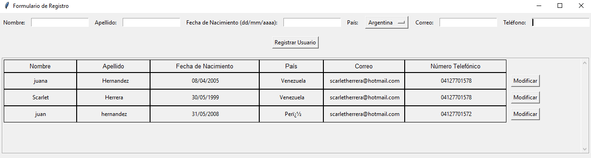

# Aplicación de Python e interfaz de Tkinter para agregar usuarios
He desarrollado este proyecto con el objetivo de aplicar y mejorar mis habilidades en el desarrollo de aplicaciones utilizando Python como lenguaje principal. La interfaz está diseñada de manera simple utilizando Tkinter, una biblioteca comúnmente empleada para crear aplicaciones de escritorio. Para almacenar la información de los usuarios registrados, el proyecto utiliza un archivo de texto como base de datos.

## 💻 Tecnologias:
- Python
- Tkinter

## ⚙️ Funcionalidades:
- **Agregar usuarios:** Esta aplicación permite registrar nuevos usuarios solicitando información como nombre, apellido, fecha de nacimiento, país, correo electrónico y número telefónico.
- **Eliminar usuario** La aplicación facilita la eliminación de usuarios, lo que implica la eliminación completa de su información del archivo de texto correspondiente.
- **Editar usuario:** Después del registro, es posible editar la información de cualquier usuario.
- **Envio de correo de bienvenida:** Automáticamente, tras el registro, se envía un correo de bienvenida al correo electrónico proporcionado por el usuario.

## ⚙ Inicialización:
Para iniciar este proyecto, es necesario tener Python instalado en su computadora. Posteriormente, podrá ejecutar la aplicación desde su editor de código seleccionando la opción "run Python file". Es importante destacar que en el código debe modificar su dirección de correo electrónico y generar una contraseña de aplicación para habilitar el servicio de envío de correos electrónicos al registrar un nuevo usuario.

## 🖼 interfaz:

